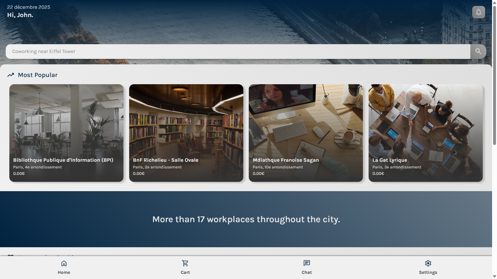
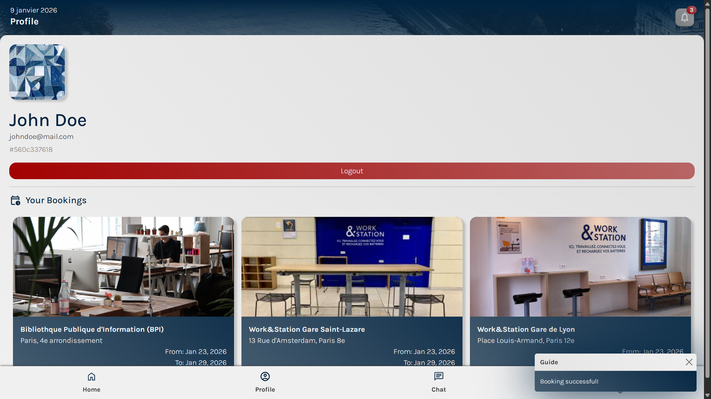
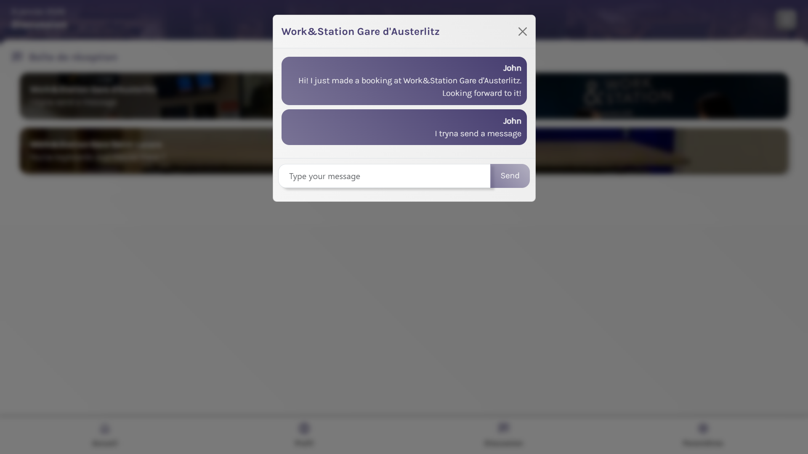

# ParisWorkHub - Frontend Application

[](https://angular.io/)
[](https://www.typescriptlang.org/)
[](https://www.docker.com/)
[](http://creativecommons.org/licenses/by-nc/4.0/)

> **Live Demo:** [https://parisworkhub.eu](https://parisworkhub.eu)

**This repository contains the frontend application** for a coworking space booking platform.
Built with **Angular 20** and **TypeScript**, this modern web interface consumes RESTful APIs from separate backend microservices.

---

## 📸 Screenshots

| **Home & Search** | **Booking Flow** | **Real-time Chat** |
|:---:|:---:|:---:|
|  |  |  |

*(Screenshots are stored in the /screenshots folder)*

---

## 🚀 Key Features

- **Authentication System**: Secure JWT login/registration with route guards.
- **Dynamic Booking**: Complete profile management and date validation.
- **Real-Time Messaging**: Chat interface powered by Redis.
- **Internationalization (i18n)**: Multi-language support with centralized configuration (English & French).
- **Policy & Contracts**: Dedicated interfaces for legal document management.
- **Responsive Design**: Mobile-first approach using modern CSS.
- **Toast Notifications**: Feedback system for user actions.

---
## 🧠 Engineering Highlights

Beyond standard features, this project implements advanced patterns:

* **Clean Code Architecture:** Comprehensive refactoring following SOLID principles with shared services, centralized constants, and TypeScript path aliases (`@app/*`, `@shared/*`).
* **Optimized Data Fetching:** Implementation of RxJS `shareReplay` operator to cache API responses and reduce server load.
* **Automated DevOps Security:** Custom Nginx configuration handling ACME challenges for automatic **Let's Encrypt SSL** certificate generation and renewal within Docker containers.
* **Intelligent Dependency Management:** Interactive setup script that automates Docker installation, repository cloning, environment configuration, and service orchestration.
* **Strict Code Quality:** Enforced linting rules using **ESLint** with specific Angular configurations to maintain clean architecture.
* **Smart UX Patterns:** Debounced search inputs and skeleton loaders for smoother user interactions.
* **Zero Duplication:** Eliminated ~410 lines of duplicate code through service extraction and centralized utilities.

## 🛠️ Frontend Technical Stack

- **Framework**: Angular 20 (Standalone Components)
- **Language**: TypeScript 5.9
- **i18n**: ngx-translate with centralized configuration
- **State Management**: RxJS
- **HTTP Client**: Angular HttpClient
- **Routing**: Angular Router with Guards
- **Testing**: Jasmine & Karma
- **Build Tool**: Angular CLI
- **Styling**: Modern CSS with Custom Properties
- **DevOps**: Docker & Nginx (Auto-HTTPS with Let's Encrypt)

---

## 📂 Project Architecture

The project follows a modular architecture based on Feature Modules and Standalone Components with clean code principles.

    pwhui/
    ├── src/
    │   ├── app/
    │   │   ├── auth/           # Authentication strategies & Guards
    │   │   ├── profil/         # Booking workflow & State management
    │   │   ├── chat/           # Real-time messaging interface
    │   │   ├── contract/       # Legal data handling
    │   │   ├── landing/        # Home page & Search interface
    │   │   ├── navigation/     # Top navigation & Menu components
    │   │   ├── policy/         # Business rules & Policy service
    │   │   ├── settings/       # User settings & Profile management
    │   │   ├── shared/         # Reusable services, constants & models
    │   │   │   ├── constants/  # API endpoints, dates, messages, etc.
    │   │   │   ├── services/   # Cookie, date, search, animation services
    │   │   │   ├── models/     # TypeScript interfaces
    │   │   │   ├── language.service.ts    # Language management
    │   │   │   ├── language.config.ts     # i18n configuration
    │   │   │   └── translate-loader.ts    # Translation file loader
    │   │   ├── start/          # Onboarding & Welcome screens
    │   │   ├── app.config.ts   # Application configuration
    │   │   ├── app.routes.ts   # Route definitions
    │   │   ├── app.ts          # Root component
    │   │   ├── booking.service.ts  # Booking logic & API integration
    │   │   └── init.service.ts     # Application initialization
    │   ├── languages/          # Translation files (en.json, fr.json)
    │   ├── fonts/              # Custom typography assets
    │   ├── icons/              # Optimized SVG icons
    │   ├── server/             # Server-side rendering utilities
    │   ├── index.html          # HTML entry point
    │   ├── main.ts             # Application bootstrapping
    │   └── styles.css          # Global styles
    ├── docker/
    │   ├── dependencies.sh     # Automated dependency setup & management
    │   ├── development.sh      # Development environment startup
    │   ├── entrypoint.sh       # Container startup script
    │   ├── down.sh             # Service shutdown script
    │   └── production.sh       # Production deployment automation
    ├── public/                 # Static assets
    ├── screenshots/            # Documentation images
    ├── angular.json            # Angular workspace configuration
    ├── Dockerfile              # Container build instructions
    ├── nginx.conf              # Web server configuration
    ├── proxy.conf.json         # Development API proxy
    └── package.json            # Dependencies & Scripts

---

## 🌍 Internationalization

The application supports multiple languages with a centralized configuration system. All user-facing text is stored in translation files located in `src/languages/`.

### Supported Languages
- **English (en)** 🇬🇧 - Default
- **Français (fr)** 🇫🇷
- **Español (es)** 🇪🇸
- **Deutsch (de)** 🇩🇪
- **中文 (zh)** 🇨🇳
- **العربية (ar)** 🇸🇦
- **Português (pt)** 🇵🇹
- **Italiano (it)** 🇮🇹
- **日本語 (ja)** 🇯🇵
- **Русский (ru)** 🇷🇺

### Adding a New Language

1. Create a new JSON file in `src/languages/` (e.g., `ko.json`)
2. Copy the structure from `en.json` and translate all values
3. Update `src/app/shared/language.config.ts`:

```typescript
export const LANGUAGE_CONFIG = {
  defaultLanguage: 'en',
  availableLanguages: [
    { code: 'en', name: 'English', flag: '🇬🇧' },
    { code: 'fr', name: 'Français', flag: '🇫🇷' },
    { code: 'es', name: 'Español', flag: '🇪🇸' },
    { code: 'ko', name: '한국어', flag: '🇰🇷' }
  ],
  storageKey: 'preferred-language',
  useBrowserLanguage: true
};
```

### Language Detection

The application automatically detects the user's browser language on first visit:
1. If a language preference is saved in localStorage, it uses that
2. Otherwise, if the browser language matches one of the supported languages, it uses the browser language
3. If neither condition is met, it defaults to English

Users can manually switch languages in the Settings page. The preference is saved in localStorage and persists across sessions.

---

## 📦 Installation & Setup

### Prerequisites
- Node.js (LTS)
- npm or yarn
- Docker Desktop (recommended for backend services)
- Git

### Quick Start (Recommended)

The project includes an **automated setup script** that handles all backend dependencies:

1.  **Clone the repository**

        git clone https://github.com/thiercelin-loic/pwhui.git
        cd pwhui

2.  **Install frontend dependencies**

        npm install

3.  **Start development server** (automatically handles backend setup)

        npm start

    The `dependencies.sh` script will interactively:
    - Check and install Docker if needed
    - Clone missing backend repositories (auth, booking, tell)
    - Configure `.env` files with custom or default values
### Production Deployment

The project includes production-ready Docker scripts with automated SSL certificate management.

1.  **Configure production settings** in `docker/production.sh`:
    - Set your domain name
    - Set your email for Let's Encrypt notifications

2.  **Deploy:**

        bash docker/production.sh

    *Features: Nginx reverse-proxy with automatic Let's Encrypt SSL certificate generation and renewal.*

### Available NPM Scripts

- `npm start` - Start development server with backend dependencies
- `npm test` - Run unit tests (auto-starts backend services)
- `npm run build` - Build for production
- `npm run lint` - Check code quality
- `npm run backend:start` - Manually start backend services
- `npm run backend:stop` - Stop all backend services

---

## 🔗 Backend Services

This frontend application communicates with three separate NestJS microservices:

- **Auth Service** - User authentication & session management ([Repository](https://github.com/thiercelin-loic/auth))
- **Booking Service** - Workspace reservations & listings management ([Repository](https://github.com/thiercelin-loic/booking))
- **Tell Service** - Real-time messaging with Redis ([Repository](https://github.com/thiercelin-loic/tell))

> **Note:** Backend services are maintained in separate repositories. The automated setup script in this repository can clone and configure them automatically during development.

        git clone https://github.com/thiercelin-loic/tell.git
        cd tell
        docker compose up
---

## 🧪 Quality & Testing

- **Unit Tests:** `npm test` (Karma/Jasmine)
- **Linting:** `npm run lint` (ESLint + Prettier)
- **Build:** `npm run build` (Production optimized)
## 🤝 Credits & Acknowledgements

* **UI Layout & Wireframes:** Based on the work of [Rizky Sentro](https://dribbble.com/rizkysentro).
* **Integration & Logic:** Full implementation by **Loïc Thiercelin**.

---

## 👤 Author

**Loïc Thiercelin**
* LinkedIn: [linkedin.com/in/loïc-thiercelin](https://www.linkedin.com/in/loïc-thiercelin)
* Website: [parisworkhub.eu](https://parisworkhub.eu)